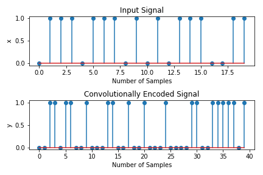
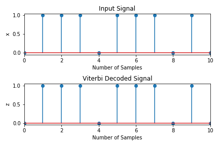

# rs_fec_conv

[](https://pypi.python.org/pypi/scikit-dsp-comm)
[](http://scikit-dsp-comm.readthedocs.io/en/latest/?badge=latest)

## Getting Started
The package rs_fec_conv is a rust binding built with [pyo3](https://github.com/PyO3/pyo3).
rs_fec_conv is intended to be used in parallel with the 
[scikit-dsp-comm](https://github.com/mwickert/scikit-dsp-comm) package.
The rust binding improve the processing time of the conv_encoder and viterbi_decoder algorithms.

### Rust Install
Rust is not needed on the system to execute the binaries since the functions are already pre-compiled.
Although, [Rust](https://www.rust-lang.org/tools/install) can be downloaded online or 
installed on Windows Subsystem for Linux.

```bash
curl --proto '=https' --tlsv1.2 -sSf https://sh.rustup.rs | sh
```
### Package Requirements
This package requires Python 3.7.x.

### rs_fec_conv install
You can download the package rs_fec_conv from PiPy [PiPy](https://www.rust-lang.org/tools/install),
or by the command
```bash
pip install rs_fec_conv
``` 

The rs_fec_package can also be downloaded from conda [conda](https://www.rust-lang.org/tools/install),
or by the command
```bash	
conda install rs_fec_conv
```

## Tutorial

### Convolutional Encoder
The function conv_encoder_rs can be implemented

```bash
import numpy as np
import matplotlib.pyplot as plt
import sk_dsp_comm.rs_fec_conv as fec

# Generate random data
N = 20
x = randint(0,2,N)

# Initialize fec_conv object with either G length 2 or 3
G =('111','101')
# G = ('11110111','11011001','10010101')
cc1 = fec.fec_conv(G,10)
state = '00'

# Convolutionally Encode Signal
y,state = cc1.conv_encoder_rs(x,state)

# Plot input signal
subplot(211)
stem(x)
xlabel('Number of Samples')
ylabel('x')
title('Input Signal')

# Plot convolutionally encoded signal
subplot(212)
stem(y)
xlabel('Number of Samples')
ylabel('y')
title('Convolutionally Encoded Signal')
tight_layout()
savefig('conv_enc.png')
```



### Viterbi Decoder
The function viterbi_decoder_rs can be implemented by
```bash
# Viterbi decode
z = cc1.viterbi_decoder_rs(y.astype(int), 'hard', 3)

# Plot input signal
subplot(211)
stem(x[:11])
xlabel('Number of Samples')
ylabel('x')
title('Input Signal')
xlim([0,10])

# Plot viterbi decoded signal
subplot(212)
stem(z)
xlabel('Number of Samples')
ylabel('z')
title('Viterbi decoded Signal')
xlim([0,10])
tight_layout()
savefig('viterbi_dec.png')
```



Since there is no channel noise added to the signal the Viterbi decoded signal results
in no bit errors from the original signal.   

### Channel Simulation
A simulation using AWGN can be done using by integrating with other functions provided 
in the scikit-dsp-comm toolbox
```bash
# Soft decision rate 1/2 simulation
N_bits_per_frame = 100000
EbN0 = 4
total_bit_errors = 0
total_bit_count = 0
cc1 = fec.fec_conv(('11101','10011'),25)

# Encode with shift register starting state of '0000'
state = '0000'
while total_bit_errors < 100:
	# Create 100000 random 0/1 bits
	x = randint(0,2,N_bits_per_frame)
	y,state = cc1.conv_encoder_rs(x,state)

	# Add channel noise to bits, include antipodal level shift to [-1,1]
	# Channel SNR is 3 dB less for rate 1/2
	yn_soft = dc.cpx_AWGN(2*y-1,EbN0-3,1) 
	yn_hard = ((np.sign(yn_soft.real)+1)/2).astype(int)
	z = cc1.viterbi_decoder_rs(yn_hard,'hard')

	# Count bit errors
	bit_count, bit_errors = dc.bit_errors(x,z)
	total_bit_errors += bit_errors
	total_bit_count += bit_count
	print('Bits Received = %d, Bit errors = %d, BEP = %1.2e' %\
		  (total_bit_count, total_bit_errors,\
		   total_bit_errors/total_bit_count))

print('*****************************************************')
print('Bits Received = %d, Bit errors = %d, BEP = %1.2e' %\
	  (total_bit_count, total_bit_errors,\
	   total_bit_errors/total_bit_count))
```
   
Rate 1/2 Object

kmax =  0, taumax = 0

Bits Received = 99976, Bit errors = 845, BEP = 8.45e-03

*****************************************************

Bits Received = 99976, Bit errors = 845, BEP = 8.45e-03